##### 2024-IA22-2TRI
# *iniciando o tutorial* 👍

<div style="display: inline_block"><br/>
   
</div>


###### (em alguns momentos vou parecer repetitivo e falar coisas óbvias, basicamente pq esse tutorial foi feito pra qualquer tongão fazer.) `AVISO` o codespace as vezes é meio lento, então não se assuste se as coisas não funcionem imediatamente

<div style="display: inline_block"><br/>
   
</div>

## `preparativos básicos`
### nós vamos usar o `codespace` do github. espero que você saiba pelo menos criar um repositório né kkkk. enfim, crie um repositório publico e que tenha read-me. depois vamos criar o codespace.

<div style="display: inline_block"><br/>
   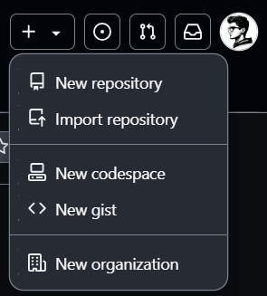
</div>

### na hora de criar o seu codespace selecione o repositório que tu acabou de criar. não se esquece de selecionar o servidor da américa do sul, caso contrário seu codespace vai travar pra cacete.

<div style="display: inline_block"><br/>
   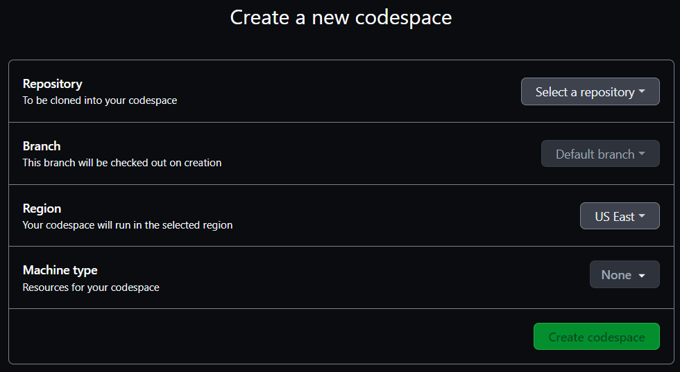
</div>

### pronto, agora vá para o seu perfil e abra o repositório... 

<div style="display: inline_block"><br/>
   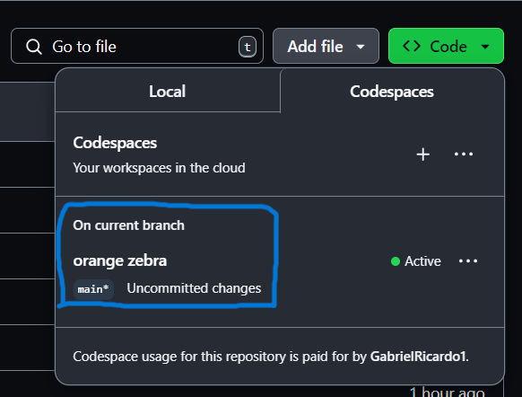
</div>

### pronto, agora começamos a codar!

#### dicas de atalhos úteis: ctrl + G = procura a linha do código 
#### ctrl + F procura palavra  

# `1.`iniciando o nosso projeto:
### abra o terminal (ctrl + ' ) e execute os comandos abaixo. não se preocupe, pode executar tudo de uma vez!

```
npm init -y
npm install express cors sqlite3 sqlite
npm install --save-dev typescript nodemon ts-node @types/express @types/cors
npx tsc --init
mkdir src
touch src/app.ts
```
<div style="display: inline_block"><br/>
   
</div>

# `2.`Configurando o **`tsconfig.json`** 👨‍💻
### Mude a linha "outDir": "./" , para "outDir": "./dist", e adicione embaixo a linha  "rootDir": "./src": seu código deve ficar assim:

<div style="display: inline_block"><br/>
   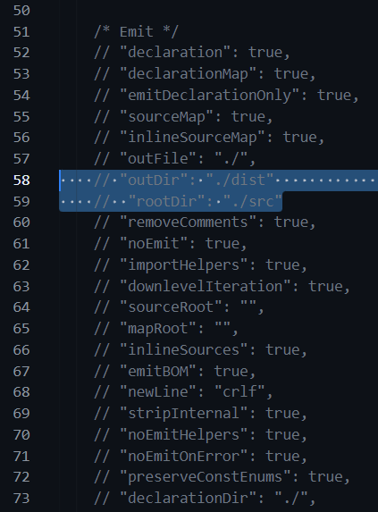
</div>


<div style="display: inline_block"><br/>
   
</div>

# `3.`Configurando o **`package.json`** 👨‍💻
### Adicione o seguinte script ao seu `package.json`:
```  "dev": "npx nodemon src/app.ts" ```
### e seu código ficará assim:

<div style="display: inline_block"><br/>
   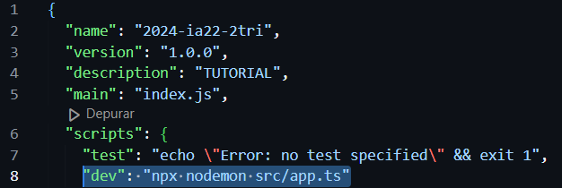
</div>

<div style="display: inline_block"><br/>
   
</div>

# `4.` Criando o arquivo inicial do servidor: 
### vá até a pasta `src` e adicione o seguinte código ao arquivo *`app.ts`*:

```ts
import express from 'express';
import cors from 'cors';

const port = 3333;
const app = express();

app.use(cors());
app.use(express.json());

app.get('/', (req, res) => {
  res.send('Hello World');
});

app.listen(port, () => {
  console.log(`Server running on port ${port}`);
});
```


<div style="display: inline_block"><br/>
   
</div>


<div style="display: inline_block"><br/>
   
</div>


# `5.`Iniciando o Servidor:
### Primeiro, instale a biblioteca REST Client; pesquise REST client na aba de extensões e aguarde a instalação.

<div style="display: inline_block"><br/>
   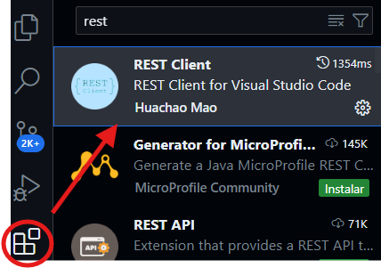
</div>

### assim que instalado, abra o terminal (ctrl + ' ) e execute o comando:

``` npm run dev ```

### Se tudo ocorrer bem, você verá a mensagem Server running on port 3333 no terminal.

### logo ao executar o comando, aparecerá uma aba no canto inferior direito. você deve selecionar a opção `Abrir no navegador.` E se você não tiver feito nenhuma cagada verá a mensagem `Hello World`

<div style="display: inline_block"><br/>
   
</div>

# `6.`Configurando Banco de dados:
### Vá até a pasta `src` e crie um arquivo nomeado de `database.ts` e adicione o seguinte código no arquivo que você criou: 

```
import { Database, open } from 'sqlite';
import sqlite3 from 'sqlite3';

let instance: Database | null = null;

export async function connect() {
  if (instance) return instance;

  const db = await open({
     filename: './src/database.sqlite',
     driver: sqlite3.Database
   });
  
  await db.exec(`
    CREATE TABLE IF NOT EXISTS users (
      id INTEGER PRIMARY KEY AUTOINCREMENT,
      name TEXT,
      email TEXT
    )
  `);

  instance = db;
  return db;
}
```
<div style="display: inline_block"><br/>
   
</div>

# `7.` Adicionando o banco de dados:
### No arquivo da pasta `src` vá até o arquivo `app.ts` e simplesmente apague todo o código do arquivo para o substituir por esse:

```
import express from 'express';
import cors from 'cors';
import { connect } from './database';

const port = 3333;
const app = express();

app.use(cors());
app.use(express.json());

app.get('/', (req, res) => {
  res.send('Hello World');
});

app.post('/users', async (req, res) => {
  const db = await connect();
  const { name, email } = req.body;

  const result = await db.run('INSERT INTO users (name, email) VALUES (?, ?)', [name, email]);
  const user = await db.get('SELECT * FROM users WHERE id = ?', [result.lastID]);

  res.json(user);
});

app.get('/users', async (req, res) => {
  const db = await connect();
  const users = await db.all('SELECT * FROM users');

  res.json(users);
});

app.listen(port, () => {
  console.log(`Server running on port ${port}`);
});
```

<div style="display: inline_block"><br/>
   
</div>

# `8.`Testando a inserção de dados: ✔
### agora, feche a pasta src e crie um arquivo chamado `restclient.http` e adicione o código abaixo:

```http
POST http://localhost:3333/users HTTP/1.1
Content-Type: application/json

{
    "name": "fulaninho beltrano",
    "email": "literalmentequaluqerbosta@gmail.com"
}

```
<div style="display: inline_block"><br/>
   
</div>

# `9.`listando o usuário:
### vá até a pasta `src` no arquivo `app.ts` e insira a rota `/users` ao servidor. deve ficar igual a imagem abaixo:

<div style="display: inline_block"><br/>
   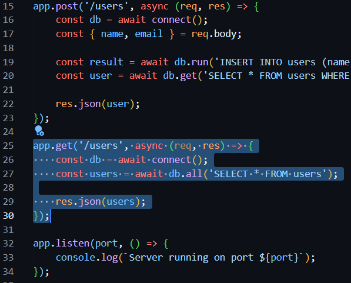
</div>

### e aqui está o código: 

```ts
app.get('/users', async (req, res) => {
  const db = await connect();
  const users = await db.all('SELECT * FROM users');

  res.json(users);
});```
```
<div style="display: inline_block"><br/>
   
</div>

# `10.` Alterando(PUT) e Deletando(delete) usuários
### agora vamos criar as rotas para alterar e deletar usuários.
### vá até a pasta `src` no arquivo `app.ts` e insira o seguinte código logo abaixo de appp.post:

deve ficar assim:

<div style="display: inline_block"><br/>
   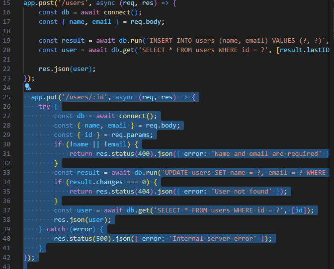
</div>

```ts
app.put('/users/:id', async (req, res) => {
    try {
        const db = await connect();
        const { name, email } = req.body;
        const { id } = req.params;
        if (!name || !email) {
            return res.status(400).json({ error: 'Name and email are required' });
        }
        const result = await db.run('UPDATE users SET name = ?, email = ? WHERE id = ?', [name, email, id]);
        if (result.changes === 0) {
            return res.status(404).json({ error: 'User not found' });
        }
        const user = await db.get('SELECT * FROM users WHERE id = ?', [id]);
        res.json(user);
    } catch (error) {
        res.status(500).json({ error: 'Internal server error' });
    }
});
```

### logo abaixo do código anterior, vamos adicionar a rota para deletar os usuários 
#### deve ficar assim:
<div style="display: inline_block"><br/>
   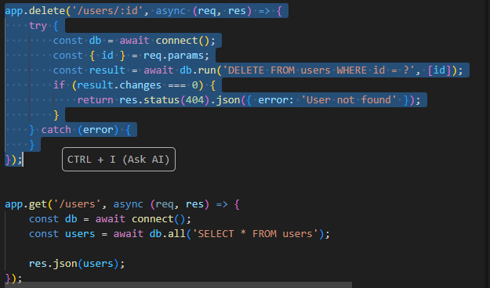
</div>

```ts
app.delete('/users/:id', async (req, res) => {
    try {
        const db = await connect();
        const { id } = req.params;
        const result = await db.run('DELETE FROM users WHERE id = ?', [id]);
        if (result.changes === 0) {
            return res.status(404).json({ error: 'User not found' });
        }
    } catch (error) {
    }
});
```

<div style="display: inline_block"><br/>
   
</div>

### `10.5`. testando as rotas que implementamos.
## se tudo ocorrer certo, você será capaz de `postar`,`editar` e `deletar` os usuários. siga os passos abaixo, mas antes de tudo, vamos iniciar o servidor:
### no terminal (ctrl + ') digite `npm run dev` e aperte enter (sim, já fizemos isso mas o servidor pode fechar coom o tempo.)

<div style="display: inline_block"><br/>
   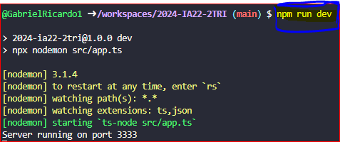
</div>


<div style="display: inline_block"><br/>
   
</div>

### `1.` abra seu arquivo `restclient.http` 
#### teoricamente, o seu código estará mais ou menos assim:
<div style="display: inline_block"><br/>
   
</div>

### `1.1` para entender se você fez tudo certo, precisamos testar se o seu usuario está sendo inserido como deveria. primeiro, aperte o botão `Send Request` logo em cima de `POST` veja a imagem acima e poste seu primeiro usuário. ✔

### `1.2` Agora, voltamos para o navegador e ao final da requisição https iremos adicionar `/users` e apertar enter:

<div style="display: inline_block"><br/>
   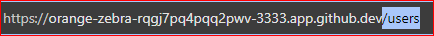
</div>

### `1.3` e pronto! seu usuário deve ter sido postado (provavelmente com um nome e email diferentes do meu) assim:

<div style="display: inline_block"><br/>
   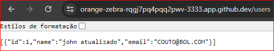
</div>

### `1.4` para adicionar o método `PUT` ao código, basta colar esse código logo abaixo do método `POST` no `restclient.http`

```
put http://localhost:3333/users/1 HTTP/1.1
Content-Type: application/json
// modifica o usuário de acordo com o ID 
{
    "name": "edite como quiser",
    "email": "editecomoquiserr@gmail.com"
}

####

```

### `1.5` para adicionar o método `DELETE` ao código, basta fazer o mesmo e colar esse código abaixo do anterior.

```
delete http://localhost:3333/users/1 HTTP/1.1
Content-Type: application/json
//deleta o usuario de acordo com o ID selecionado 
```

### `1.5` finalmente, seu `restclient.http` deve estar assim: ✔

<div style="display: inline_block"><br/>
   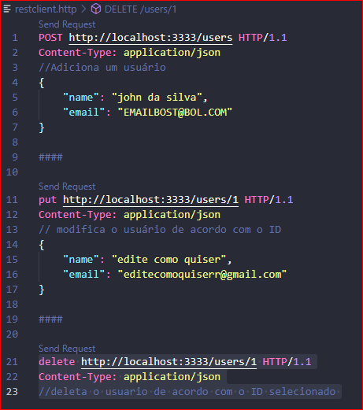
</div>

### `1.6` por fim, precisamos entender como funciona e como usar o `PUT` e o `delete` é bem simples, basicamente os dois funcionam da mesma forma em sua base. na primeira linha das funções temos a requisição `http`, para modificar um usuario devemos fazer isso:

<div style="display: inline_block"><br/>
   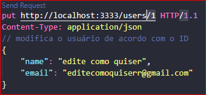
</div>

### destaquei o `/1` pq é a peça chave para modificar e deletar usuários. basicamente você altera o ID do usuário (/1 , /2 , /3...) simplesmente fazendo isso. se quiser alterar o usuario de ID 3 vai mudar `http://localhost:3333/users` para `http://localhost:3333/users/3` e nos campos de nome e email alterar o que for necessário. no meu caso, vou modificar o usuario de ID 6.

#### antes de modificar, o meu usuario aparecia assim no navegador: 

<div style="display: inline_block"><br/>
   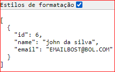
</div>

#### agora, para fazer a alteração, modifique o ID e o nome e email para testar. quando tudo estiver modificado como deveria, aperte o botão de `Send Request`:

<div style="display: inline_block"><br/>
   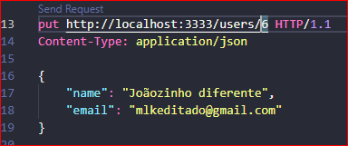
</div>

#### e pronto ✔, seu usuário foi modificado. o meu, por exemplo, ficou assim:

<div style="display: inline_block"><br/>
   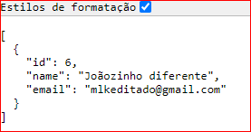
</div>

### `1.7` para deletar usuarios é a mesma coisa, a diferença é que você precisa informar apenas o ID do usuario. vou apagar o usuario 6 que acabamos de criar.

<div style="display: inline_block"><br/>
   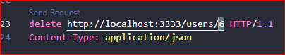
</div>

#### e pronto, após usar o `Send Request` o usuário que você escolheu não existirá mais.

<div style="display: inline_block"><br/>
   
</div>

### `11` agora vamos fazer a parte visual do nosso site, para isso, crie uma pasta chamada `public` (deve ser uma pasta isolada, não vai estar dentro de outra.) dentro dessa nova pasta, crie o arquivo `index.html` e adicione o seguinte código a ele:

```html
<!DOCTYPE html>
<html lang="en">

<head>
  <meta charset="UTF-8">
  <meta name="viewport" content="width=device-width, initial-scale=1.0">
  <title>Document</title>
  <style>
    body {
      font-family: 'Arial', sans-serif;
      background-color: #f4f4f4;
      color: #333;
      display: flex;
      flex-direction: column;
      align-items: center;
      padding: 20px;
    }

    form {
      background-color: #fff;
      padding: 20px;
      border-radius: 8px;
      box-shadow: 0 0 10px rgba(0, 0, 0, 0.1);
      margin-bottom: 30px;
      width: 300px;
      display: flex;
      flex-direction: column;
      gap: 10px;
    }

    input[type="text"], input[type="email"] {
      padding: 10px;
      border: 1px solid #ccc;
      border-radius: 4px;
      font-size: 14px;
    }

    button[type="submit"] {
      background-color: #5cb85c;
      color: white;
      border: none;
      padding: 10px;
      border-radius: 4px;
      cursor: pointer;
      font-size: 14px;
      transition: background-color 0.3s ease;
    }

    button[type="submit"]:hover {
      background-color: #4cae4c;
    }

    table {
      width: 100%;
      max-width: 800px;
      border-collapse: collapse;
      background-color: #fff;
      border-radius: 8px;
      box-shadow: 0 0 10px rgba(0, 0, 0, 0.1);
    }

    th, td {
      padding: 12px;
      text-align: left;
      border-bottom: 1px solid #ddd;
    }

    th {
      background-color: #5cb85c;
      color: white;
    }

    tbody tr:hover {
      background-color: #f1f1f1;
    }

    .excluir, .editar {
      background-color: #d9534f;
      color: white;
      border: none;
      padding: 5px 10px;
      border-radius: 4px;
      cursor: pointer;
      transition: background-color 0.3s ease;
    }

    .editar {
      background-color: #0275d8;
    }

    .excluir:hover {
      background-color: #c9302c;
    }

    .editar:hover {
      background-color: #025aa5;
    }
  </style>
</head>

<body>
  <form>
    <input type="text" name="name" placeholder="Nome">
    <input type="email" name="email" placeholder="Email">
    <button type="submit">Cadastrar</button>
  </form>

  <table>
    <thead>
      <tr>
        <th>Id</th>
        <th>Name</th>
        <th>Email</th>
        <th>Ações</th>
      </tr>
    </thead>
    <tbody>
      <!--  -->
    </tbody>
  </table>

  <script>
    // 
    const form = document.querySelector('form')

    form.addEventListener('submit', async (event) => {
      event.preventDefault()

      const name = form.name.value
      const email = form.email.value

      await fetch('/users', {
        method: 'POST',
        headers: { 'Content-Type': 'application/json' },
        body: JSON.stringify({ name, email })
      })

      form.reset()
      fetchData()
    })

    // 
    const tbody = document.querySelector('tbody')

    async function fetchData() {
      const resp = await fetch('/users')
      const data = await resp.json()

      tbody.innerHTML = ''

      data.forEach(user => {
        const tr = document.createElement('tr')
        tr.innerHTML = `
          <td>${user.id}</td>
          <td>${user.name}</td>
          <td>${user.email}</td>
          <td>
            <button class="excluir">Excluir</button>
            <button class="editar">Editar</button>
          </td>
        `

        const btExcluir = tr.querySelector('button.excluir')
        const btEditar = tr.querySelector('button.editar')

        btExcluir.addEventListener('click', async () => {
          await fetch(`/users/${user.id}`, { method: 'DELETE' })
          tr.remove()
        })

        btEditar.addEventListener('click', async () => {
          const name = prompt('Novo nome:', user.name)
          const email = prompt('Novo email:', user.email)

          await fetch(`/users/${user.id}`, {
            method: 'PUT',
            headers: { 'Content-Type': 'application/json' },
            body: JSON.stringify({ name, email })
          })

          fetchData()
        })

        tbody.appendChild(tr)
      })
    }

    fetchData()
  </script>
</body>

</html>

```

<div style="display: inline_block"><br/>
   
</div>

### `12.` agora, a única coisa que precisamos fazer é adicionar a seguinte linha ao arquivo `app.ts` da pasta `src` logo onde mostro na imagem abaixo.

```ts
app.use(express.static(__dirname + '/../public'))
```

<div style="display: inline_block"><br/>
   
</div>

<div style="display: inline_block"><br/>
   
</div>

### `13.` agora é só testar. se o seu servidor tiver fechado com o tempo, basta colar `npm run dev` e abrir o navegador. nosso site estará assim.:

## e por fim...
#### precisamos adicionar, comitar e subir as mudanças feitas para o GitHub. copie, cole e dê enter nos scripts abaixo no terminal:

```bash
git add . ; git commit -m ... ; git push origin main
```

#### agora sim, terminamos. obrigado e espero que tenha dado tudo certo. me segue no insta pra eu saber quem fez meu tutorial. `couto_71`


<div style="display: inline_block"><br/>
   
</div>

<div style="display: inline_block"><br/>
   
</div>


